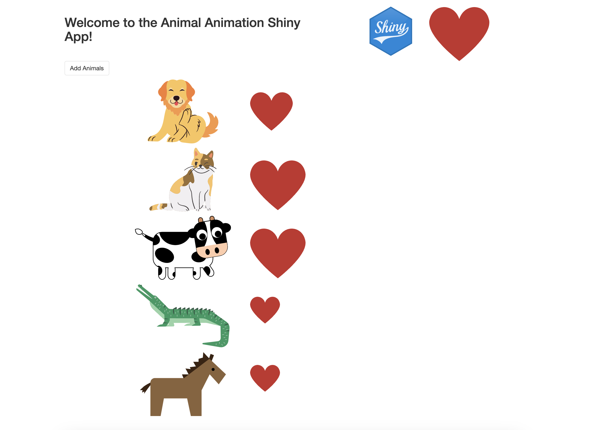

```{r setup, include=FALSE}
knitr::opts_chunk$set(echo = TRUE)
```

# Animal Animation Shiny App

This is a simple Shiny app that lets you create your own custom animal animation by clicking on different animal images. Each time you click on an animal, a heart will appear and the selected animal will be added to the list below. You can add up to five animals to the list, and each animal will appear with its own heart.



## Key Concepts

The Animal Animation App uses the following key concepts in Shiny:

* `reactiveVal()`: A function used to create a reactive value that can be read and modified by other reactive expressions. In this app, we use reactiveVal() to store the list of selected animals and the number of times the "Add Animals" button has been clicked. Also we use `reactiveVal()` to store the number of clicks on the shiny image.

* `reactiveValues()`: A function used to create a list of reactive values that can be read and modified by other reactive expressions. In this app, we use reactiveValues() to track the number of times each animal is clicked.

* Reactivity: In Shiny, reactivity is the concept of automatically updating outputs based on changes to inputs or other reactive expressions. In this app, we use reactive expressions and observeEvents to update the list of selected animals and the number of times each animal is clicked.

* Render reactive HTML: In Shiny, you can use `renderUI()` to render reactive HTML that updates automatically based on changes to inputs or other reactive expressions. In this app, we use `renderUI()` to render the list of selected animals with their corresponding hearts.

Basic styling in Shiny apps: In this app, we use CSS to style the animal images and the hearts that appear when you click on them.

## How to use the app

To use the Animal Animation App, simply follow these steps:

Click on the "Add Animals" button to add animals to the list.

Click on different animal images to create your custom animation.

Each time you click on an animal, a heart will appear and the selected animal will be added to the list below.

You can add up to five animals to the list, and each animal will appear with its own heart.

## Technical details

The Animal Animation App is built using the following R packages:

* Shiny
* shinyjs

To install these packages, run the following command:

`install.packages(c("shiny", "shinyjs"))`

## Credits

The Animal Animation Shiny App was inspired by one of the sections from the Udemy course “Modern React with Redux” by Stephen Grider. Feel free to use, modify, and distribute the app as you like.

